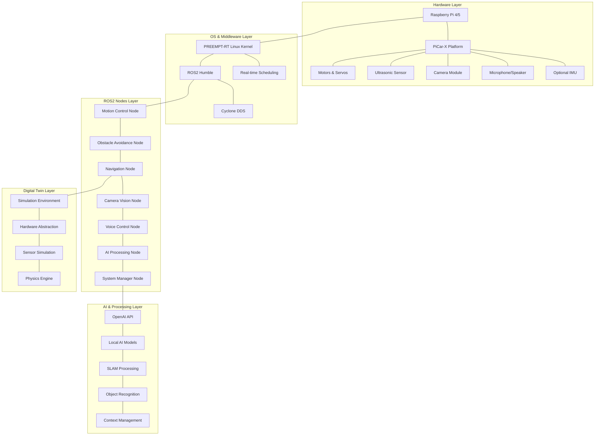
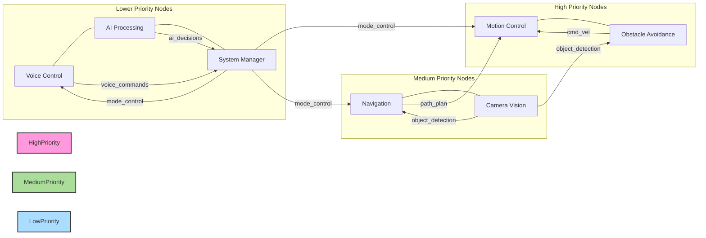
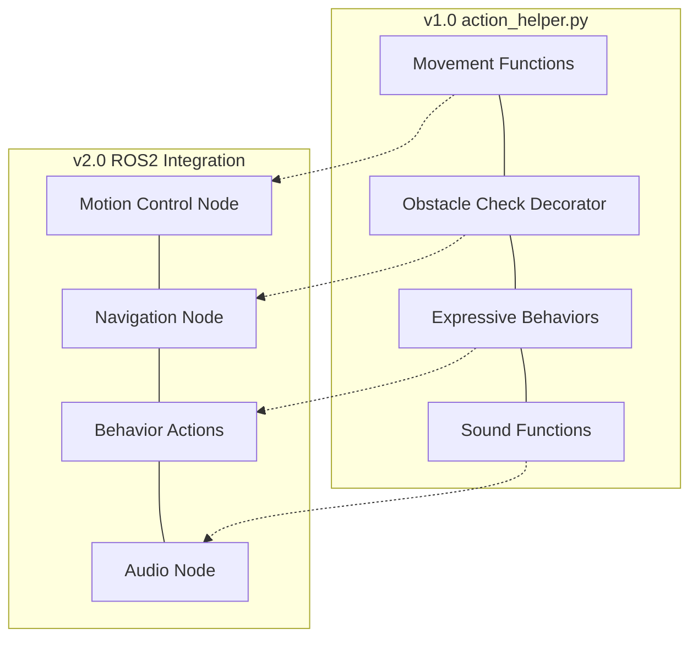
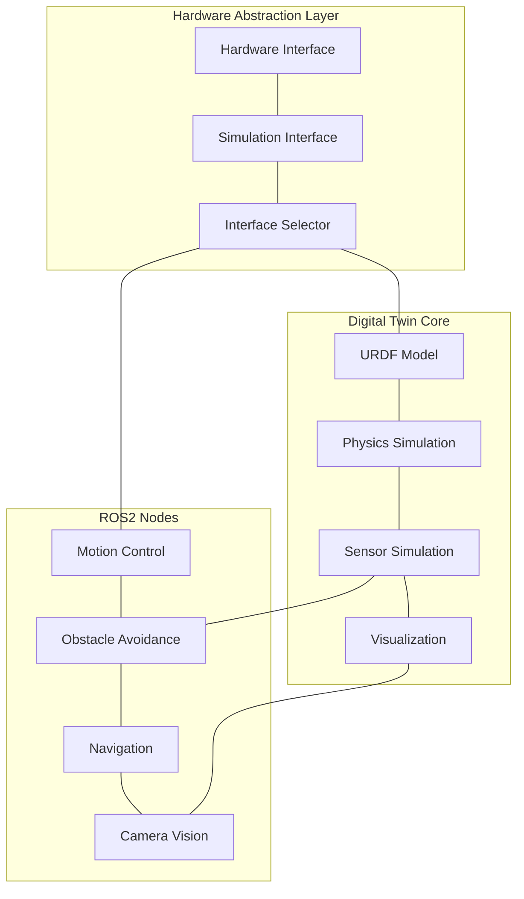
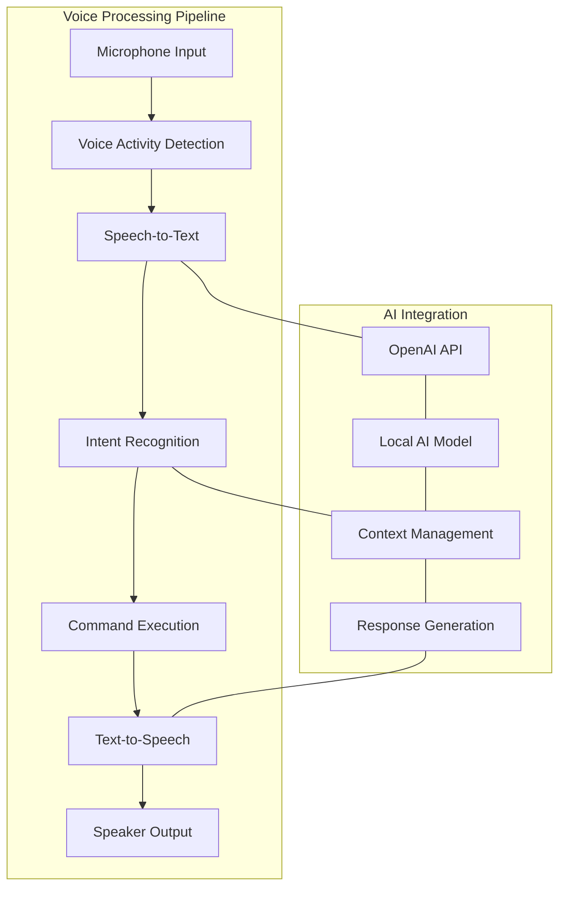

# Nevil-picar v2.0: Architectural Overview

## 1. System Architecture Overview

Nevil-picar v2.0 represents a significant evolution from v1.0, implementing a multi-threaded ROS2 architecture with PREEMPT-RT integration for real-time performance. This document provides a comprehensive architectural overview of the system.



## 2. Core System Components and Interactions

### 2.1 Hardware Components

| Component | Description | Interactions |
|-----------|-------------|--------------|
| Raspberry Pi 4/5 | Main controller running ROS2 and PREEMPT-RT | Interfaces with all hardware components |
| PiCar-X Platform | Physical chassis with motors and servos | Controlled by Motion Control Node |
| Camera Module | Vision input for object detection and tracking | Feeds data to Camera Vision Node |
| Ultrasonic Sensor | Distance measurement for obstacle detection | Feeds data to Obstacle Avoidance Node |
| Microphone/Speaker | Audio I/O for voice interaction | Interfaces with Voice Control Node |
| Optional IMU | Motion stabilization and orientation data | Provides data to Navigation Node |

### 2.2 Software Components

| Component | Description | Interactions |
|-----------|-------------|--------------|
| ROS2 Humble | Middleware for inter-node communication | Connects all nodes via topics, services, and actions |
| PREEMPT-RT Kernel | Real-time Linux kernel for deterministic performance | Provides scheduling guarantees for critical nodes |
| Cyclone DDS | Low-latency messaging system | Handles ROS2 message transport |
| OpenCV + YOLO | Vision processing libraries | Used by Camera Vision Node |
| OpenAI API | Cloud-based AI processing | Used by AI Processing Node and Voice Control Node |
| Gemma 2/TinyLlama | Local AI models for offline operation | Used by AI Processing Node |
| SLAM Algorithms | Mapping and localization | Used by Navigation Node |

### 2.3 ROS2 Node Structure



## 3. Multi-Threading Architecture (ROS2 + PREEMPT-RT)

### 3.1 ROS2 MultiThreadedExecutor

Nevil v2.0 leverages ROS2's MultiThreadedExecutor to enable true parallel processing across nodes:

```python
def main():
    rclpy.init()
    motion = MotionControl()
    obstacle = ObstacleAvoidance()
    navigation = Navigation()
    vision = CameraVision()
    voice = VoiceControl()
    ai = AIProcessing()
    system = SystemManager()

    executor = MultiThreadedExecutor()
    executor.add_node(motion)
    executor.add_node(obstacle)
    executor.add_node(navigation)
    executor.add_node(vision)
    executor.add_node(voice)
    executor.add_node(ai)
    executor.add_node(system)

    try:
        executor.spin()
    except KeyboardInterrupt:
        pass

    # Cleanup nodes
    rclpy.shutdown()
```

### 3.2 PREEMPT-RT Integration

The PREEMPT-RT patched kernel enables deterministic, low-latency performance:

1. **Kernel Configuration**:
   - PREEMPT-RT patched kernel installed on Raspberry Pi
   - Real-time scheduling policies (SCHED_FIFO) enabled
   - Power-saving features disabled to prevent latency spikes

2. **Priority-Based Scheduling**:
   - Critical nodes (obstacle avoidance, motion control) run at highest priority
   - Medium-priority nodes (navigation, vision) run at intermediate priority
   - Non-critical nodes (voice, AI) run at lower priority

3. **Launch with Priority**:
   ```python
   nodes = [
       ("nevil", "motion_control", 90),      # Highest priority
       ("nevil", "obstacle_avoidance", 85),
       ("nevil", "navigation", 80),
       ("nevil", "camera_vision", 70),
       ("nevil", "voice_control", 60),
       ("nevil", "ai_processing", 50),
       ("nevil", "system_manager", 40)       # Lowest priority
   ]

   for package, executable, priority in nodes:
       cmd = ["sudo", "chrt", "-f", str(priority), "ros2", "run", package, executable]
       subprocess.Popen(cmd)
   ```

### 3.3 Performance Metrics

- **Latency Requirements**:
  - Obstacle detection and avoidance: < 50ms
  - Motion control command execution: < 20ms
  - Voice command recognition: < 1s
  - System mode switching: < 500ms

## 4. Key Interfaces Between Components

### 4.1 action_helper.py API Integration

The action_helper.py API from v1.0 provides proven navigation capabilities that will be adapted for the ROS2 architecture:



Key functions from action_helper.py will be adapted as ROS2 services and actions:

1. **Basic Movement**:
   - `move_forward_this_way` → ROS2 action with obstacle checking
   - `move_backward_this_way` → ROS2 action
   - `turn_left`, `turn_right` → ROS2 actions

2. **Expressive Behaviors**:
   - `wave_hands`, `shake_head`, `nod`, etc. → ROS2 actions

3. **Obstacle Checking**:
   - The `with_obstacle_check` decorator will be implemented as a ROS2 service that can be called by any node requiring obstacle awareness

### 4.2 ROS2 Topic/Service/Action Interfaces

| Interface Type | Name | Description | Publishers | Subscribers |
|----------------|------|-------------|------------|-------------|
| Topic | `/cmd_vel` | Velocity commands | Navigation, Obstacle Avoidance | Motion Control |
| Topic | `/ultrasonic_data` | Distance sensor readings | Sensor Driver | Obstacle Avoidance |
| Topic | `/camera/image_raw` | Raw camera images | Camera Driver | Camera Vision |
| Topic | `/object_detections` | Detected objects | Camera Vision | Navigation, AI Processing |
| Topic | `/system_mode` | Current system mode | System Manager | All Nodes |
| Service | `/check_obstacle` | Obstacle check service | Obstacle Avoidance | Any Node |
| Action | `/navigate_to_point` | Navigation action | Navigation | System Manager, AI Processing |
| Action | `/perform_behavior` | Expressive behavior action | Motion Control | System Manager, AI Processing |

## 5. Digital Twin Simulation Architecture

### 5.1 ARCHES-PiCar-X Integration

The digital twin simulation will be based on the ARCHES-PiCar-X project, providing a virtual representation of the physical robot:



### 5.2 Hardware Abstraction Layer

A key component of the digital twin architecture is the hardware abstraction layer that allows seamless switching between simulation and physical hardware:

```python
class HardwareInterface:
    def __init__(self, simulation_mode=False):
        self.simulation_mode = simulation_mode
        if simulation_mode:
            self.interface = SimulationInterface()
        else:
            self.interface = PhysicalHardwareInterface()
    
    def set_motor_speed(self, left, right):
        return self.interface.set_motor_speed(left, right)
    
    def get_distance(self):
        return self.interface.get_distance()
    
    def get_camera_image(self):
        return self.interface.get_camera_image()
    
    # Additional hardware methods...
```

### 5.3 Simulation Environment

The simulation environment will include:

1. **URDF Model**: Accurate representation of PiCar-X physical dimensions and properties
2. **Physics Simulation**: Realistic motion dynamics and interactions
3. **Sensor Simulation**: Virtual ultrasonic, camera, and IMU sensors
4. **Environment Simulation**: Configurable test environments for navigation and SLAM testing

## 6. Text and Voice Interface Integration

### 6.1 Voice Control Architecture



### 6.2 Hybrid AI Processing

Nevil v2.0 implements a hybrid approach to AI processing:

1. **Cloud-Based Processing (Online)**:
   - OpenAI API for advanced language understanding
   - High-quality text-to-speech synthesis
   - Complex reasoning and conversation

2. **Local Processing (Offline)**:
   - Gemma 2 or TinyLlama for basic cognition
   - Local speech recognition for command processing
   - Object recognition using optimized models

3. **Seamless Switching**:
   - Automatic fallback to local processing when offline
   - Prioritization based on task complexity
   - Caching of common responses for reduced latency

### 6.3 Conversation and Context Management

```python
class ContextManager:
    def __init__(self):
        self.conversation_history = []
        self.environment_context = {}
        self.user_profiles = {}
        self.current_mode = "conversation"
    
    def add_user_utterance(self, user_id, text):
        self.conversation_history.append({"role": "user", "id": user_id, "content": text})
    
    def add_system_response(self, text):
        self.conversation_history.append({"role": "assistant", "content": text})
    
    def update_environment(self, location, objects, room_type):
        self.environment_context.update({
            "location": location,
            "visible_objects": objects,
            "room_type": room_type
        })
    
    def get_context_for_ai(self):
        # Format context for AI processing
        return {
            "conversation": self.conversation_history[-10:],  # Last 10 exchanges
            "environment": self.environment_context,
            "mode": self.current_mode
        }
```

## 7. Architectural Improvements Over v1.0

### 7.1 Multi-Threading Enhancements

| v1.0 Limitation | v2.0 Improvement |
|-----------------|------------------|
| Single-threaded execution | True parallel processing with MultiThreadedExecutor |
| Sequential processing of sensors and actions | Concurrent processing with priority-based scheduling |
| Blocking operations during speech processing | Non-blocking callbacks with real-time guarantees |
| Limited responsiveness during complex tasks | Deterministic performance with PREEMPT-RT |

### 7.2 Real-Time Performance

| v1.0 Limitation | v2.0 Improvement |
|-----------------|------------------|
| Unpredictable latency for critical operations | Sub-millisecond latency for obstacle avoidance |
| System jitter affecting motion control | Deterministic execution with PREEMPT-RT |
| Interference between subsystems | Isolated execution with priority scheduling |
| Limited performance monitoring | Comprehensive latency tracking and reporting |

### 7.3 Modularity and Extensibility

| v1.0 Limitation | v2.0 Improvement |
|-----------------|------------------|
| Monolithic code structure | Modular ROS2 node architecture |
| Tight coupling between components | Well-defined interfaces using ROS2 communication patterns |
| Limited abstraction for hardware | Hardware abstraction layer for simulation and physical hardware |
| Fixed behavior patterns | Configurable behaviors through ROS2 parameters |

## 8. Potential Architectural Challenges

### 8.1 Real-Time Performance Challenges

1. **Raspberry Pi Resource Constraints**:
   - Limited CPU cores for parallel execution
   - Memory constraints for running multiple AI models
   - **Recommendation**: Implement resource monitoring and dynamic priority adjustment

2. **Python GIL Limitations**:
   - Python's Global Interpreter Lock may limit true parallelism
   - **Recommendation**: Consider C++ implementations for critical nodes or use multiprocessing

3. **Real-Time Kernel Stability**:
   - PREEMPT-RT on Raspberry Pi may have stability issues
   - **Recommendation**: Thorough testing and fallback mechanisms

### 8.2 Integration Challenges

1. **ROS2 and action_helper.py Integration**:
   - Adapting existing code to ROS2 paradigms
   - **Recommendation**: Create wrapper classes that maintain API compatibility

2. **Digital Twin Fidelity**:
   - Ensuring simulation accurately reflects physical behavior
   - **Recommendation**: Calibration procedures to match simulation parameters to physical measurements

3. **AI Model Performance**:
   - Local models may have limited capabilities compared to cloud
   - **Recommendation**: Hybrid approach with task-specific optimization

### 8.3 Operational Challenges

1. **Power Management**:
   - Real-time performance vs. battery life trade-offs
   - **Recommendation**: Implement power-aware mode switching

2. **Network Dependency**:
   - Reliance on cloud AI for advanced features
   - **Recommendation**: Robust offline fallback capabilities

3. **System Complexity**:
   - Increased complexity may impact maintainability
   - **Recommendation**: Comprehensive documentation and monitoring tools

## 9. Implementation Recommendations

### 9.1 Development Approach

1. **Incremental Implementation**:
   - Start with core ROS2 nodes and PREEMPT-RT integration
   - Add digital twin simulation capabilities
   - Integrate AI processing and voice interfaces
   - Implement advanced features (SLAM, environmental learning)

2. **Testing Strategy**:
   - Unit testing for individual nodes
   - Integration testing for node interactions
   - Simulation testing before physical deployment
   - Performance testing for latency and jitter

3. **Documentation**:
   - Comprehensive API documentation
   - Architecture diagrams and interface specifications
   - Performance benchmarks and requirements

### 9.2 Technical Recommendations

1. **ROS2 Best Practices**:
   - Use ROS2 lifecycle nodes for managed startup/shutdown
   - Implement proper error handling and recovery
   - Use QoS profiles appropriate for each communication type

2. **Real-Time Optimization**:
   - Avoid blocking operations in callbacks
   - Use ROS2 timers instead of sleep functions
   - Implement watchdog mechanisms for critical nodes

3. **AI Integration**:
   - Implement efficient API usage to minimize latency and costs
   - Optimize local models for Raspberry Pi performance
   - Develop seamless switching between cloud and local processing

## 10. Conclusion

Nevil-picar v2.0 represents a significant architectural advancement over v1.0, implementing a multi-threaded ROS2 architecture with PREEMPT-RT integration for real-time performance. The system is designed to provide a responsive, intelligent robotic companion capable of simultaneous operations across multiple processing threads.

The architecture addresses the limitations of v1.0 by enabling true parallel processing, deterministic real-time performance, and seamless integration between physical hardware and simulation. The hybrid AI approach provides both advanced cloud-based capabilities and robust offline functionality.

By following the implementation recommendations and addressing the potential challenges, Nevil-picar v2.0 will deliver a sophisticated robotic platform that meets the requirements for autonomous navigation, environmental mapping, multi-modal interaction, and hybrid AI processing.