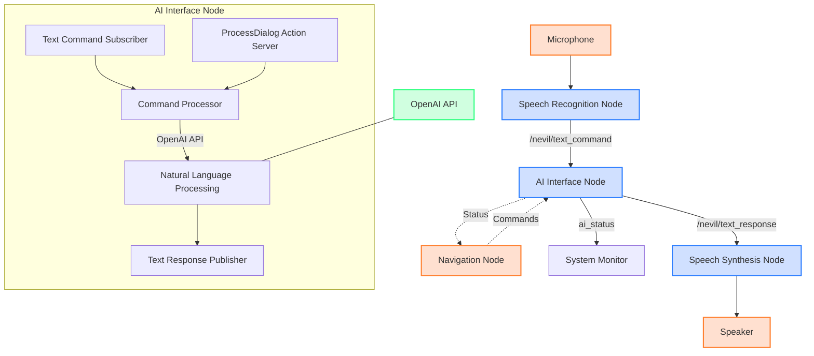

# Nevil Robot AI Interface Architecture

## 1. System Overview

The Nevil robot's AI interface system provides natural language processing capabilities, enabling conversational interaction with the robot. This document outlines the architecture of the AI interface subsystem, including its components, communication patterns, and integration with other robot subsystems.

## 2. Architecture Diagram



## 3. Component Descriptions

### 3.1 Core Components

| Component | Description | ROS2 Node | Topics/Services |
|-----------|-------------|-----------|-----------------|
| **Speech Recognition Node** | Converts audio input to text | `speech_recognition_node` | Publishes: `/nevil/text_command` |
| **AI Interface Node** | Processes text commands and generates responses | `ai_interface_node` | Subscribes: `/nevil/text_command`<br>Publishes: `/nevil/text_response`, `ai_status`<br>Action Server: `process_dialog` |
| **Speech Synthesis Node** | Converts text responses to speech | `speech_synthesis_node` | Subscribes: `/nevil/text_response` |

### 3.2 AI Interface Internals

The AI Interface Node consists of several internal components:

1. **Text Command Subscriber**: Receives text commands from the Speech Recognition Node
2. **Command Processor**: Processes commands and determines appropriate responses
3. **Natural Language Processing**: Integrates with OpenAI API for advanced language understanding
4. **Text Response Publisher**: Sends text responses to the Speech Synthesis Node
5. **ProcessDialog Action Server**: Provides a more complex interface for multi-turn dialog processing

## 4. Communication Flow

### 4.1 Primary Communication Path

1. The **Microphone** captures audio input from the user
2. The **Speech Recognition Node** converts audio to text and publishes to `/nevil/text_command`
3. The **AI Interface Node** subscribes to `/nevil/text_command`, processes the text using the OpenAI API, and publishes the response to `/nevil/text_response`
4. The **Speech Synthesis Node** subscribes to `/nevil/text_response`, converts the text to speech, and outputs through the **Speaker**

### 4.2 Action-Based Communication

For more complex dialog interactions, the system uses the ROS2 Action interface:

1. A client (e.g., Navigation Node) sends a goal to the `process_dialog` action server
2. The **AI Interface Node** processes the dialog and provides feedback during processing
3. When complete, the **AI Interface Node** returns a result to the client

## 5. Integration with Robot Subsystems

### 5.1 Navigation Integration

The AI Interface Node can receive commands that affect robot navigation. These commands are processed and appropriate instructions are sent to the Navigation Node.

### 5.2 System Status Monitoring

The AI Interface Node publishes status updates to the `ai_status` topic, which can be monitored by system components to track the state of the AI subsystem.

## 6. Error Handling and Fallback Mechanisms

### 6.1 OpenAI API Fallback

If the OpenAI API is unavailable or returns an error, the AI Interface Node implements a fallback mechanism that provides basic responses based on keyword matching.

### 6.2 Error Reporting

Errors are logged and published to the `ai_status` topic to ensure system-wide awareness of any issues with the AI subsystem.

## 7. Implementation Details

### 7.1 AI Interface Node Implementation

The AI Interface Node is implemented as a Python ROS2 node with the following structure:

```python
class AIInterfaceNode(Node):
    def __init__(self):
        super().__init__('ai_interface')
        
        # Publishers
        self.text_response_pub = self.create_publisher(String, '/nevil/text_response', 10)
        self.status_pub = self.create_publisher(String, 'ai_status', 10)
        
        # Subscribers
        self.text_command_sub = self.create_subscription(
            String,
            '/nevil/text_command',
            self.handle_text_command,
            10
        )
        
        # Action server
        self._action_server = ActionServer(
            self,
            ProcessDialog,
            'process_dialog',
            self.execute_dialog_callback
        )
        
        # OpenAI API configuration
        self.openai_api_key = os.getenv('OPENAI_API_KEY')
```

### 7.2 Message and Action Definitions

The system uses standard ROS2 String messages for basic communication and custom action definitions for more complex interactions:

```
# ProcessDialog.action
string initial_utterance
---
bool success
string message
string final_state
---
string current_state
string last_utterance
```

## 8. Future Improvements

### 8.1 Context Management

Implement a context management system to maintain conversation history and provide more coherent multi-turn interactions.

### 8.2 Intent Recognition

Add intent classification to better understand user commands and route them to appropriate subsystems.

### 8.3 Local Processing

Implement local processing options for basic commands to reduce dependency on external APIs.

### 8.4 Command Routing

Develop a more sophisticated command routing system to direct specific commands to the appropriate robot subsystems.

## 9. Deployment Configuration

The AI Interface Node is deployed as part of the `nevil_interfaces_ai` package and can be launched using the following launch file:

```python
# nevil_interfaces_ai.launch.py
from launch import LaunchDescription
from launch_ros.actions import Node

def generate_launch_description():
    ld = LaunchDescription()
    
    ld.add_action(Node(
        package='nevil_interfaces_ai',
        executable='ai_interface_node',
        name='ai_interface',
        output='screen',
    ))
    
    # Add other nodes as needed
    
    return ld
```

## 10. Conclusion

The AI Interface architecture provides a flexible and extensible framework for natural language interaction with the Nevil robot. By leveraging ROS2's communication patterns and integrating with external AI services, the system enables sophisticated conversational capabilities while maintaining robustness through fallback mechanisms and error handling.