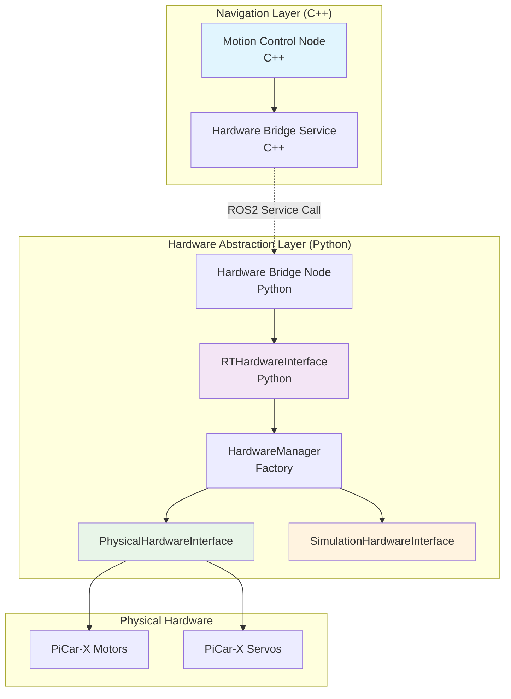
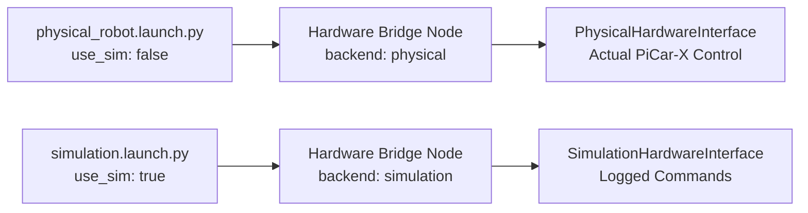

# Motion Control Hardware Integration Architecture

## Overview
This document outlines the integration architecture between the C++ motion control node and the Python hardware abstraction layer to enable actual physical movement in Nevil-picar v2.0.

## Current State Analysis

### C++ Motion Control Node (`nevil_navigation`)
- **Location**: [`src/nevil_navigation/src/motion_control_node.cpp`](src/nevil_navigation/src/motion_control_node.cpp:1)
- **Current Behavior**: Receives [`geometry_msgs::msg::Twist`](src/nevil_navigation/src/motion_control_node.cpp:23) commands and logs them
- **Missing**: Actual hardware control integration
- **Key Method**: [`cmd_vel_callback()`](src/nevil_navigation/src/motion_control_node.cpp:40) at line 62-65 just logs commands

### Python Hardware Abstraction (`nevil_realtime`)
- **Location**: [`src/nevil_realtime/nevil_realtime/rt_hardware_interface.py`](src/nevil_realtime/nevil_realtime/rt_hardware_interface.py:1)
- **Capabilities**: Complete hardware abstraction with physical/simulation backends
- **Key Interface**: [`RTHardwareInterface`](src/nevil_realtime/nevil_realtime/rt_hardware_interface.py:200) with [`move_robot()`](src/nevil_realtime/nevil_realtime/rt_hardware_interface.py:220) method

## Integration Architecture



## Integration Components

### 1. Hardware Bridge Service (C++)
**Purpose**: Translate C++ motion commands to Python hardware interface calls

**Implementation Strategy**:
- Create ROS2 service interface for hardware commands
- Integrate into existing motion control node
- Maintain backward compatibility

### 2. Hardware Bridge Node (Python)
**Purpose**: Receive service calls and execute via hardware abstraction layer

**Key Features**:
- Service server for motion commands
- Integration with existing [`RTHardwareInterface`](src/nevil_realtime/nevil_realtime/rt_hardware_interface.py:200)
- Configuration-driven backend selection
- Error handling and status reporting

### 3. Service Interface Definition
**Purpose**: Define communication contract between C++ and Python layers

```idl
# nevil_interfaces/srv/HardwareCommand.srv
# Request
float64 linear_x
float64 angular_z
bool emergency_stop
---
# Response
bool success
string status_message
string hardware_backend
```

## Implementation Plan

### Phase 1: Service Interface Creation
1. **Create service definition** in [`nevil_interfaces`](src/nevil_interfaces/) package
2. **Update package dependencies** for service compilation
3. **Generate service interfaces** for both C++ and Python

### Phase 2: Python Hardware Bridge Node
1. **Create hardware bridge node** using existing [`RTHardwareInterface`](src/nevil_realtime/nevil_realtime/rt_hardware_interface.py:200)
2. **Implement service server** for motion commands
3. **Add configuration support** for backend selection
4. **Integrate with launch files**

### Phase 3: C++ Motion Control Integration
1. **Add service client** to existing motion control node
2. **Replace logging** with actual service calls
3. **Add error handling** and status reporting
4. **Maintain safety limits** and validation

### Phase 4: Launch Configuration
1. **Update launch files** to include hardware bridge
2. **Add parameter passing** for backend selection
3. **Ensure proper startup order** and dependencies

## Configuration Integration

### Launch Parameter Flow


### Parameter Mapping
- **Launch Parameter**: `use_sim` (boolean)
- **Bridge Parameter**: `hardware_backend` (string: "physical" | "simulation")
- **Interface Selection**: Automatic via [`HardwareManager`](src/nevil_realtime/nevil_realtime/rt_hardware_interface.py:150)

## Error Handling Strategy

### Graceful Degradation
1. **Physical Hardware Failure**: Auto-fallback to simulation mode
2. **Service Communication Failure**: Log errors, continue operation
3. **Invalid Commands**: Validate and clamp to safety limits

### Status Reporting
- **Hardware Backend Status**: Report active backend type
- **Command Execution Status**: Success/failure for each command
- **Error Recovery**: Automatic retry and fallback mechanisms

## Performance Considerations

### Latency Optimization
- **Service Call Overhead**: ~1-2ms typical ROS2 service latency
- **Hardware Interface**: Direct GPIO access for minimal latency
- **Safety Validation**: Pre-computed limits for fast validation

### Real-time Characteristics
- **Motion Control Loop**: 100ms timer (10Hz) - adequate for robot movement
- **Hardware Interface**: Thread-safe with mutex protection
- **Emergency Stop**: Immediate response via service priority

## Testing Strategy

### Unit Testing
- **Service Interface**: Test request/response handling
- **Hardware Bridge**: Test backend selection and command execution
- **Integration**: Test C++ to Python communication

### Integration Testing
- **End-to-End**: Test complete command flow from navigation to hardware
- **Backend Switching**: Test runtime switching between physical/simulation
- **Error Scenarios**: Test failure modes and recovery

## Migration Path

### Backward Compatibility
- **Existing Interfaces**: Maintain all current ROS2 topics and services
- **Launch Files**: Extend existing launch files without breaking changes
- **Configuration**: Add new parameters with sensible defaults

### Deployment Strategy
1. **Development**: Test with simulation backend
2. **Staging**: Test with physical hardware in controlled environment
3. **Production**: Deploy with automatic fallback capabilities

## Security Considerations

### Hardware Access Control
- **GPIO Permissions**: Ensure proper user permissions for hardware access
- **Service Authentication**: Consider adding authentication for hardware commands
- **Safety Limits**: Enforce maximum speed and acceleration limits

### Error Isolation
- **Hardware Failures**: Isolate hardware errors from navigation logic
- **Service Failures**: Graceful degradation when bridge is unavailable
- **Resource Protection**: Prevent hardware damage from invalid commands

## Future Enhancements

### Advanced Features
- **Adaptive Control**: Dynamic adjustment based on hardware feedback
- **Predictive Maintenance**: Monitor hardware health and performance
- **Multi-Robot Support**: Extend architecture for multiple robot instances

### Performance Optimization
- **Direct Integration**: Consider direct C++ hardware interface for ultra-low latency
- **Batch Commands**: Support for batched motion commands
- **Hardware Acceleration**: Utilize hardware-specific optimizations

## Conclusion

This integration architecture provides a clean separation between the navigation logic (C++) and hardware abstraction (Python) while enabling actual physical movement. The design maintains backward compatibility, supports both physical and simulation modes, and provides robust error handling and graceful degradation.

The key innovation is the service-based bridge that allows the existing C++ motion control node to leverage the comprehensive Python hardware abstraction layer without requiring a complete rewrite of the navigation system.