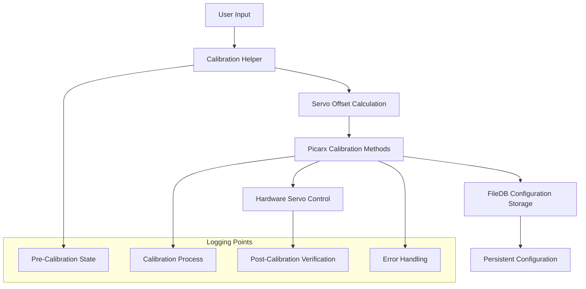

# Servo Calibration Logging Architecture

## Component Overview

### Configuration Storage Layer
- **Location**: [`fileDB`](src/nevil_navigation/nevil_navigation/picarx.py:62) configuration system
- **Config Keys**:
  - `picarx_dir_servo` - Direction servo calibration value
  - `picarx_cam_pan_servo` - Camera pan servo calibration value  
  - `picarx_cam_tilt_servo` - Camera tilt servo calibration value
- **Storage**: `/opt/picar-x/picar-x.conf`

### Hardware Abstraction Layer
- **Servo Objects**: [`robot_hat.Servo`](src/nevil_navigation/nevil_navigation/picarx.py:65-67)
  - `cam_pan` (P0)
  - `cam_tilt` (P1) 
  - `dir_servo_pin` (P2)

### Calibration Interface Layer
- **Methods**:
  - [`dir_servo_calibrate()`](src/nevil_navigation/nevil_navigation/picarx.py:174-177)
  - [`cam_pan_servo_calibrate()`](src/nevil_navigation/nevil_navigation/picarx.py:184-187)
  - [`cam_tilt_servo_calibrate()`](src/nevil_navigation/nevil_navigation/picarx.py:189-192)

### User Interface Layer
- **Interactive Calibration**: [`calibration.py`](src/nevil_navigation/nevil_navigation/calibration.py:144-146)
- **Key Bindings**: W/D (increase), S/A (decrease), SPACE (save)

## Data Flow Architecture



## Logging Strategy

### 1. Structured Logging Levels
- **DEBUG**: Detailed servo movements and calculations
- **INFO**: Calibration operations and state changes
- **WARNING**: Constraint violations and recoveries
- **ERROR**: Hardware failures and configuration issues

### 2. Log Context
- Timestamp
- Servo type (direction/pan/tilt)
- Previous calibration value
- New calibration value
- Hardware response status
- Configuration persistence status

### 3. Integration Points
- Pre-calibration state capture
- Real-time calibration adjustments
- Post-calibration verification
- Error recovery procedures

## Logging File Locations

### Primary Log Files
- **Servo Calibration Log**: `/home/dan/Nevil-picar-v2/logs/servo_calibration.log`
- **Debug Log**: `/home/dan/Nevil-picar-v2/logs/servo_calibration_debug.log`
- **System Configuration**: `/opt/picar-x/picar-x.conf` (servo calibration values)
- **Console Output**: Real-time display during calibration

### Log File Structure
```
/home/dan/Nevil-picar-v2/
├── logs/
│   ├── servo_calibration.log          # Main calibration session logs
│   └── servo_calibration_debug.log    # Detailed debug information
└── src/nevil_navigation/nevil_navigation/calibration.py

/opt/picar-x/
└── picar-x.conf                       # Persistent servo calibration storage
```

### Log Rotation & Management
- **Retention**: Persistent in project logs directory
- **Size Limit**: 10MB per log file (auto-rotation)
- **Backups**: 3 for main log, 2 for debug log
- **Configuration**: Values persisted in `/opt/picar-x/picar-x.conf`

### Access Permissions
- **Log Files**: `644` (read/write owner, read others)
- **Config Files**: `777` with owner restrictions
- **Log Directory**: Project-managed (`/home/dan/Nevil-picar-v2/logs/`)

## Security Considerations
- No sensitive data in logs
- Configuration file access permissions
- Hardware state validation
- Calibration value bounds checking