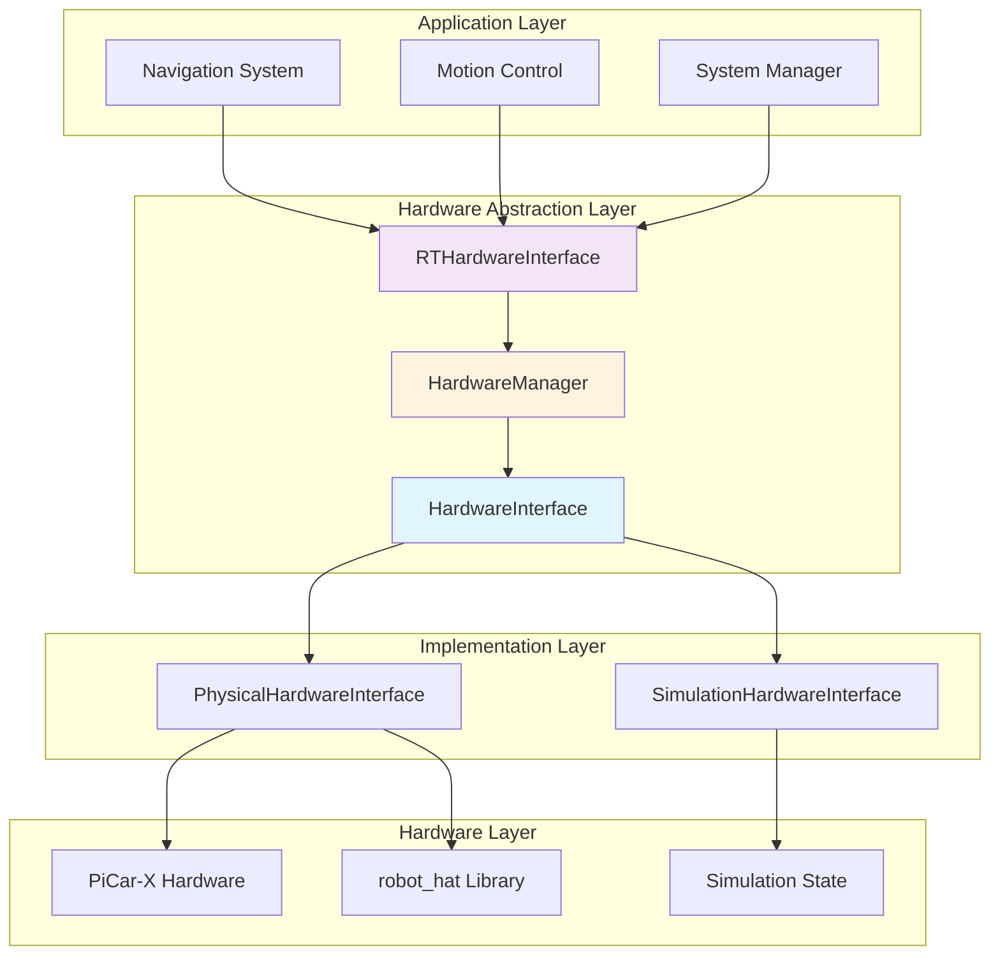
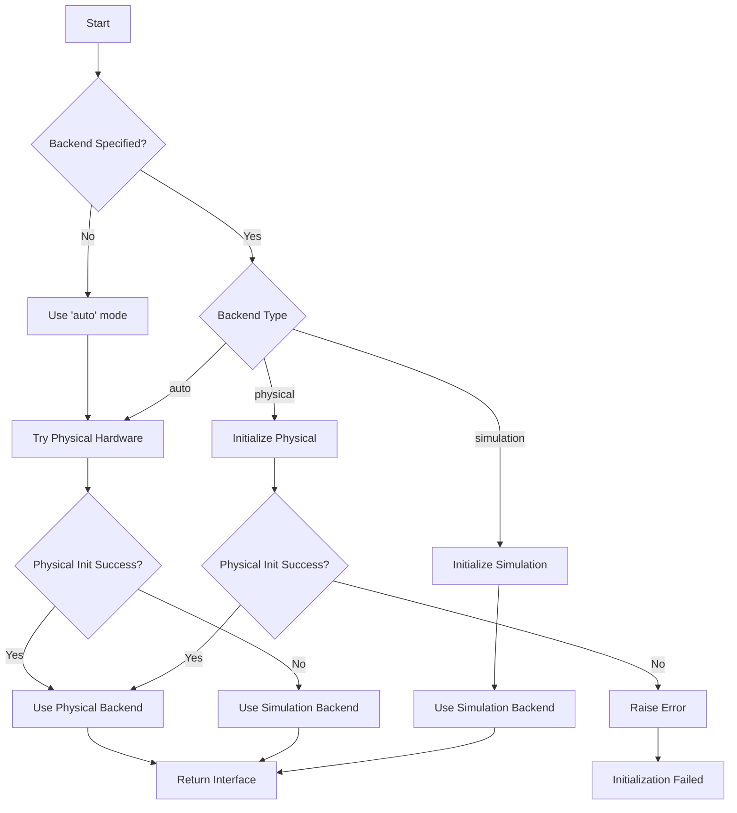

# Nevil-picar v2.0 Hardware Architecture

## Overview

The Nevil-picar v2.0 hardware architecture provides a clean separation between physical hardware and simulation modes through an abstract interface design. This architecture enables seamless switching between hardware and simulation backends while maintaining consistent API contracts.

## Architecture Principles

### 1. Interface Segregation
- **Abstract Base Class**: `HardwareInterface` defines the contract for all hardware implementations
- **Clean Contracts**: All hardware operations are defined through abstract methods
- **Type Safety**: Strong typing ensures compile-time verification of interface compliance

### 2. Dependency Inversion
- **High-level Logic**: Navigation and control systems depend on abstractions, not concrete implementations
- **Runtime Selection**: Hardware backend is selected at runtime based on configuration
- **Testability**: Easy mocking and testing through interface abstraction

### 3. Strategy Pattern
- **Interchangeable Backends**: Physical and simulation implementations are interchangeable
- **Runtime Switching**: Backend selection happens during initialization
- **Consistent Behavior**: Same API regardless of underlying implementation

### 4. Factory Pattern
- **Centralized Creation**: `HardwareManager` handles backend instantiation
- **Configuration-driven**: Backend selection based on configuration parameters
- **Error Handling**: Graceful fallback mechanisms for initialization failures

## Component Architecture



## Interface Definitions

### HardwareInterface (Abstract Base Class)

```python
class HardwareInterface(ABC):
    @abstractmethod
    def initialize(self) -> bool:
        """Initialize the hardware interface."""
        
    @abstractmethod
    def set_motor_speeds(self, left: float, right: float) -> None:
        """Set motor speeds (-1.0 to 1.0)."""
        
    @abstractmethod
    def set_steering_angle(self, angle: float) -> None:
        """Set steering angle (-30 to 30 degrees)."""
        
    @abstractmethod
    def get_distance(self) -> float:
        """Get distance from ultrasonic sensor in cm."""
        
    @abstractmethod
    def set_camera_pan(self, angle: float) -> None:
        """Set camera pan angle (-90 to 90 degrees)."""
        
    @abstractmethod
    def set_camera_tilt(self, angle: float) -> None:
        """Set camera tilt angle (-35 to 65 degrees)."""
        
    @abstractmethod
    def stop(self) -> None:
        """Stop all motors."""
        
    @abstractmethod
    def reset(self) -> None:
        """Reset hardware to default state."""
        
    @abstractmethod
    def cleanup(self) -> None:
        """Clean up hardware resources."""
        
    @abstractmethod
    def get_backend_type(self) -> str:
        """Get the backend type (physical/simulation)."""
```

## Backend Implementations

### Physical Hardware Backend

**Class**: `PhysicalHardwareInterface`

**Responsibilities**:
- Interface with PiCar-X hardware through robot_hat library
- Thread-safe hardware access with mutex protection
- Error handling and logging for hardware failures
- Resource management and cleanup

**Key Features**:
- **Thread Safety**: All hardware operations protected by mutex
- **Error Recovery**: Graceful handling of hardware communication failures
- **Resource Management**: Proper initialization and cleanup of hardware resources
- **Performance**: Optimized for real-time control requirements

### Simulation Backend

**Class**: `SimulationHardwareInterface`

**Responsibilities**:
- Simulate hardware behavior without physical dependencies
- Maintain internal state for all hardware components
- Provide realistic responses for sensor readings
- Enable development and testing without hardware

**Key Features**:
- **State Simulation**: Internal tracking of motor speeds, steering, camera position
- **Realistic Responses**: Simulated sensor readings and hardware behavior
- **Development Support**: Enables development without physical hardware
- **Testing**: Consistent behavior for automated testing

## Hardware Manager (Factory)

**Class**: `HardwareManager`

**Responsibilities**:
- Backend selection based on configuration
- Auto-detection with graceful fallback
- Error handling during initialization
- Configuration management

**Backend Selection Logic**:



## Configuration Options

### Backend Selection

```python
# Auto-detection (default)
hw = RTHardwareInterface(node, backend='auto')

# Force simulation mode
hw = RTHardwareInterface(node, backend='simulation')

# Force physical hardware mode
hw = RTHardwareInterface(node, backend='physical')

# Configuration-driven selection
config = {'hardware_backend': 'simulation'}
hw = RTHardwareInterface(node, config=config)
```

### Configuration Parameters

| Parameter | Type | Default | Description |
|-----------|------|---------|-------------|
| `hardware_backend` | string | `'auto'` | Backend selection: 'auto', 'physical', 'simulation' |
| `hardware_timeout` | float | `5.0` | Hardware initialization timeout (seconds) |
| `simulation_distance` | float | `100.0` | Default simulated distance reading (cm) |
| `debug_mode` | bool | `false` | Enable debug logging for hardware operations |

## Integration Points

### ROS2 Integration

The hardware interface integrates seamlessly with ROS2 systems:

```python
# In motion control node
from nevil_realtime.rt_hardware_interface import RTHardwareInterface

class MotionControlNode(Node):
    def __init__(self):
        super().__init__('motion_control')
        
        # Initialize hardware with auto-detection
        self.hardware = RTHardwareInterface(self, backend='auto')
        
        # Use hardware interface
        self.hardware.set_motor_speeds(0.5, 0.5)
```

### Launch File Configuration

```xml
<launch>
    <node pkg="nevil_core" exec="motion_control_node">
        <param name="hardware_backend" value="simulation"/>
        <param name="debug_mode" value="true"/>
    </node>
</launch>
```

## Error Handling and Resilience

### Graceful Degradation

1. **Auto-detection Fallback**: If physical hardware fails, automatically fall back to simulation
2. **Emergency Fallback**: If all initialization fails, use simulation as emergency backup
3. **Runtime Error Recovery**: Continue operation even if individual hardware operations fail

### Error Scenarios

| Scenario | Behavior | Recovery |
|----------|----------|----------|
| Hardware not connected | Fall back to simulation | Log warning, continue operation |
| Hardware communication failure | Log error, continue with last known state | Retry on next operation |
| Invalid configuration | Use default configuration | Log error, use auto-detection |
| Resource exhaustion | Clean up and reinitialize | Attempt recovery, fall back if needed |

## Performance Considerations

### Thread Safety

- **Mutex Protection**: All physical hardware operations protected by threading.Lock()
- **Non-blocking Simulation**: Simulation operations are non-blocking and fast
- **Resource Contention**: Minimal lock contention through optimized critical sections

### Real-time Performance

- **Low Latency**: Direct hardware access with minimal abstraction overhead
- **Predictable Timing**: Consistent operation timing regardless of backend
- **Resource Efficiency**: Minimal memory and CPU overhead

## Testing Strategy

### Unit Testing

```python
def test_simulation_backend():
    logger = Mock()
    hw = SimulationHardwareInterface(logger)
    
    assert hw.initialize() == True
    hw.set_motor_speeds(0.5, -0.5)
    assert hw.left_motor_speed == 50
    assert hw.right_motor_speed == -50
```

### Integration Testing

```python
def test_hardware_manager_auto_detection():
    logger = Mock()
    hw = HardwareManager.create_hardware_interface(logger, 'auto')
    
    # Should return either physical or simulation backend
    assert hw.get_backend_type() in ['physical', 'simulation']
```

### System Testing

- **Hardware-in-the-loop**: Test with actual PiCar-X hardware
- **Simulation Testing**: Comprehensive testing in simulation mode
- **Failover Testing**: Test graceful degradation scenarios

## Migration Guide

### From Legacy RTHardwareInterface

The new architecture maintains backward compatibility:

```python
# Legacy usage (still works)
hw = RTHardwareInterface(node)

# New explicit usage
hw = RTHardwareInterface(node, backend='auto')

# Check backend type
if hw.simulation_mode:
    print("Running in simulation")
else:
    print("Running on hardware")
```

### Configuration Migration

```python
# Old approach (implicit simulation fallback)
try:
    hw = RTHardwareInterface(node)
except Exception:
    # Handle failure
    pass

# New approach (explicit configuration)
hw = RTHardwareInterface(node, backend='auto')
print(f"Using {hw.get_backend_type()} backend")
```

## Future Extensions

### Additional Backends

The architecture supports easy addition of new backends:

```python
class MockHardwareInterface(HardwareInterface):
    """Mock hardware for testing specific scenarios."""
    
    def initialize(self) -> bool:
        return True
    
    # Implement other abstract methods...
```

### Enhanced Configuration

Future enhancements may include:

- **Dynamic Backend Switching**: Runtime switching between backends
- **Hybrid Modes**: Partial simulation with some physical components
- **Remote Hardware**: Network-based hardware interfaces
- **Hardware Profiles**: Predefined configurations for different hardware setups

## Conclusion

The Nevil-picar v2.0 hardware architecture provides a robust, scalable, and maintainable foundation for hardware abstraction. The clean separation between physical and simulation modes enables:

- **Development Flexibility**: Work with or without physical hardware
- **Testing Reliability**: Consistent behavior across environments
- **Deployment Confidence**: Graceful handling of hardware availability
- **Maintenance Simplicity**: Clear interfaces and responsibilities

This architecture ensures that the navigation system can operate reliably regardless of hardware availability, while maintaining the performance and real-time characteristics required for autonomous vehicle control.